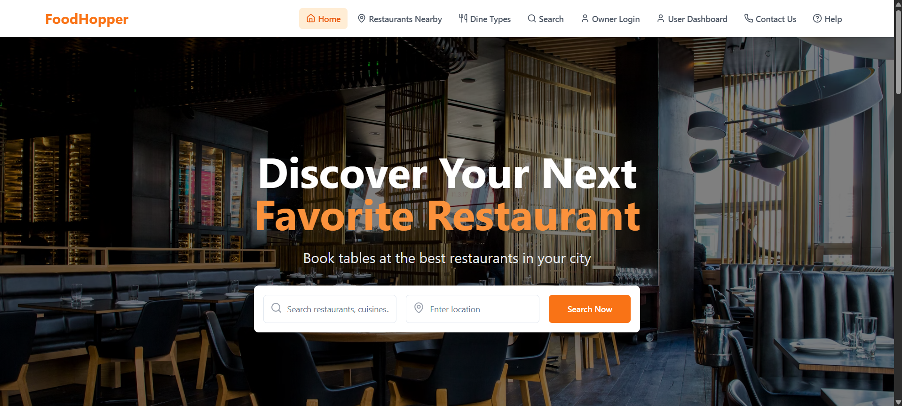

# 🍽️ FoodHopper

**Discover Your Next Favorite Restaurant!**
FoodHopper is a modern web platform to explore, search, and book tables at the best restaurants near you. Whether you're craving a cozy cafe or a classy dine-in, FoodHopper makes it effortless.

---

## 🚀 Features

* 🔍 **Search Restaurants & Cuisines** by name, type, or location
* 🗺️ **Find Nearby Restaurants** quickly using intuitive filters
* 🧾 **View Dine Types**: Breakfast, Lunch, Dinner, Buffet, etc.
* 👤 **User Dashboard** for easy booking management
* 🔐 **Owner Login** to manage restaurant listings
* 📱 Fully **Responsive UI** built with **React** & **Bootstrap**
* 🎨 Aesthetic and user-friendly interface

---

## 🖼️ Preview

> Here's a sneak peek at the landing page:



---

## 🛠️ Tech Stack

* **Frontend**: React, React Router, Bootstrap, CSS
* **State Management**: React Hooks
* **Icons**: React-Bootstrap Icons
* **Deployment**: GitHub Pages / Vercel / Netlify

---

## 📦 Installation

```bash
# Clone the repository
git clone https://github.com/YourUsername/FoodHopper.git

# Navigate into the directory
cd FoodHopper

# Install dependencies
npm install

# Start development server
npm run dev
```

> ⚠️ Make sure `vite.config.js` is set up with proper `base` if deploying to GitHub Pages.

---

## 🌐 Deployment (GitHub Pages)

1. Add homepage URL in `package.json`:

   ```json
   "homepage": "https://(add ur userame eg : Shirisha-g-shiri).github.io/FoodHopper"
   ```

2. Set `base` in `vite.config.js`:

   ```js
   base: "/FoodHopper/",
   ```

3. Add deploy scripts:

   ```json
   "scripts": {
     "predeploy": "npm run build",
     "deploy": "gh-pages -d dist"
   }
   ```

4. Run:

   ```bash
   npm run deploy
   ```

---

## 📧 Contact

Have feedback or feature requests?
📬 Email us at: shirisha140105@gmail.com

---

## 📄 License

This project is licensed under the **MIT License**.
Feel free to use, fork, and contribute!

